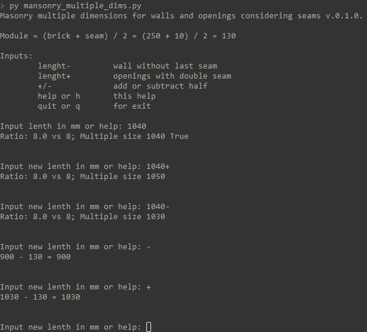

Masonry multiple dimensions for walls and openings considering seams v.0.1.0.

	lenght-		wall without last seam
	lenght+		openings with double seam
	+/-		add or subtract half
	help or h	this help
	quit or q	for exit

